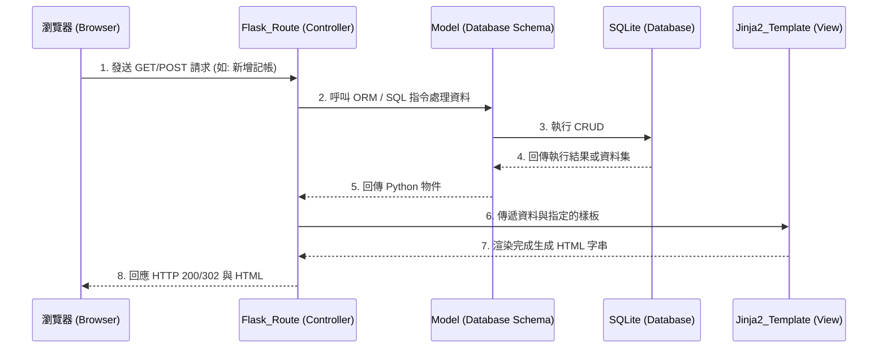

# 系統架構文件 (Architecture)

這份文件根據 PRD 描述的「個人記帳簿」需求，規劃出對應的技術架構、資料夾結構與元件關係。本專案為一個輕量級的網頁應用程式，主要目標客群為學生。

## 1. 技術架構說明

### 選用技術與原因
- **後端框架：Python + Flask**
  - **原因**：Flask 是一個輕量且彈性的 Python 微框架，對於不需要龐大且複雜架構（例如 Django）的小型專案非常合適。MVP 的開發能夠非常快速且好上手。
- **模板引擎：Jinja2**
  - **原因**：與 Flask 緊密整合，能在伺服器端直接將後端的資料動態渲染到 HTML 中，並且不需要設計複雜的前後端分離及 API 架構，不僅降低開發成本，也符合技術限制。
- **資料庫：SQLite**
  - **原因**：SQLite 是一套無伺服器 (Serverless) 的輕量資料庫。所有資料都儲存在單一檔案中，無需額外設定資料庫伺服器，完全符合學生記帳輕量化的需求及目標。
- **前端呈現：自訂 CSS / HTML + JavaScript**
  - **原因**：搭配 Jinja2 產生響應式 (Responsive) 介面，並採用簡單乾淨的 CSS 來營造良好體驗，可能適度搭配一點點 JavaScript 來繪製（如 Chart.js）收支比例圖表。

### Flask MVC (MTV) 模式說明
雖然傳統稱為 MVC，在 Flask 開發中此架構概念可以拆解如下：
- **Model (資料模型)**：負責與 SQLite 溝通，定義收支紀錄與分類的資料表結構 (Schema)，處理資料的新增、讀取、更新、刪除 (CRUD)。
- **View (視圖/模板)**：即 Jinja2 HTML 樣板，負責接受呈現畫面與介面。它將後端傳過來的資料轉換成使用者看到的網頁。
- **Controller (控制器/路由)**：在 Flask 中由 Routes 擔任。負責接收來自瀏覽器的 HTTP 請求，向 Model 取得需要的資料後，傳遞給 View (Jinja2) 生成畫面，最後將生成的 HTML 回傳給瀏覽器。

---

## 2. 專案資料夾結構

依據模組化及關注點分離的原則，專案採用下列的資料夾與檔案結構：

```text
web_app_development/
├── app/                      # 應用程式主資料夾
│   ├── models/               # Model：負責定義資料表結構與資料庫操作
│   │   ├── __init__.py
│   │   └── transaction.py    # 記帳紀錄與分類的資料模型
│   ├── routes/               # Controller：負責路由設定與商業邏輯
│   │   ├── __init__.py
│   │   ├── index.py          # 首頁 (含餘額統計、最近明細)
│   │   └── transaction_routes.py # 記帳新增、編輯、刪除、歷史列表
│   ├── templates/            # View：Jinja2 HTML 樣板檔案
│   │   ├── base.html         # 全站共用版型 (Header, Footer, Navbar)
│   │   ├── index.html        # 首頁統計與總覽
│   │   └── list.html         # 明細列表與新增頁面
│   └── static/               # 靜態資源檔案
│       ├── css/
│       │   └── style.css     # 自訂樣式表，確保清爽的使用者介面
│       └── js/
│           └── charts.js     # 圖表相關的 JS (例如支出佔比)
├── instance/                 # 不進入版本控制的執行個體檔案
│   └── database.db           # SQLite 資料庫檔案
├── docs/                     # 專案文件 (PRD, 架構文件等)
├── app.py                    # 整個 Flask 專案的啟動入口點
├── requirements.txt          # Python 相依套件清單
└── README.md                 # 專案說明文件
```

---

## 3. 元件關係圖

以下展示使用者與應用程式互動時的資料流向。

### 請求處理流程 (Mermaid)



---

## 4. 關鍵設計決策

1. **採用伺服器端渲染 (Server-Side Rendering)**
   - **決策**：不採用 API + SPA (前後端分離) 的開發模式，全面由 Flask 搭配 Jinja2 在後端渲染好 HTML 後送出。
   - **原因**：針對 MVP 階段的「個人記帳簿」，頁面互動大多為單純的表單送出與資料列表展示。伺服器端渲染能大幅降低開發與除錯成本，並且讓核心功能快速上線。

2. **檔案路由模組分離設定 (Blueprints** 或是 **獨立 routes 檔案)**
   - **決策**：將路由統一拆分到 `app/routes/` 之下，而不是全部塞在 `app.py` 中。
   - **原因**：雖然目前功能單純，但收支明細、報表統計、以及未來可能增加的使用者自訂分類等，會讓路由快速變多。良好的分類可以提升程式碼可讀性與後續擴充的彈性。

3. **使用獨立的 `static/css` 提供現代化響應式介面**
   - **決策**：在 `static/css/style.css` 透過 Vanilla CSS 來建立視覺感受良好、適合手機版面的響應式排版。
   - **原因**：學生記帳多在手機上操作，行動版體驗是該產品的成功關鍵。我們不依賴重型的 CSS 框架，藉由輕量的自訂 CSS 控制樣式，能減少不必要的資源加載，且能客製化充滿現代感的圓角及色調。

4. **資料庫獨立放置於 `instance/` 資料夾**
   - **決策**：將 `database.db` 置於 `instance/` 資料夾中。
   - **原因**：這是一個安全及維護的慣例；這能避免實際的本機生產資料檔案被不小心 `git commit` 而外洩或被覆蓋。
