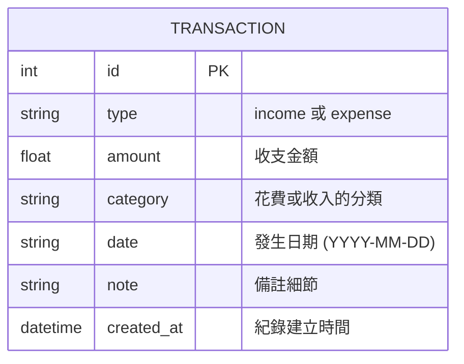

# 資料庫設計文件 (DB_DESIGN)

根據「個人記帳簿」的系統需求，本文件定義了底層 SQLite 的資料庫結構。為了保持專案輕量並符合 MVP，初期我們將所有的收支紀錄統整於一個 `transactions` 表單中。分類 (Category) 目前則直接以字串形式存入，免去過度複雜的關聯設計。

## 1. ER 圖（實體關係圖）



> **說明**：在 MVP 的階段，因為不需要複雜的分類管理或是使用者管理，因此資料庫只有單一實體 `TRANSACTION`。

## 2. 資料表詳細說明

### TRANSACTION (收支紀錄表)

負責儲存使用者每一筆收入或支出的明細。

| 欄位名稱   | 資料型別 (SQLite) | 約束 (Constraints)       | 說明 |
| :------- | :-------------- | :--------------------- | :--- |
| `id`       | INTEGER         | PRIMARY KEY, AUTOINCREMENT | 資料表的唯一識別碼 |
| `type`     | TEXT            | NOT NULL               | 標記此筆為收入 (`income`) 或支出 (`expense`) |
| `amount`   | REAL            | NOT NULL               | 該筆紀錄之金額數值 |
| `category` | TEXT            | NOT NULL               | 分類名稱（例：早餐、交通、薪水） |
| `date`     | TEXT            | NOT NULL               | 交易發生的日期時間 (建議格式為 ISO8601: `YYYY-MM-DD`) |
| `note`     | TEXT            | NULL                   | 補充說明的自由填寫備註 |
| `created_at`| TEXT           | DEFAULT CURRENT_TIMESTAMP | 此紀錄被建立進系統的問題時間 |

---

## 3. SQL 建表語法

位於 `database/schema.sql`

```sql
CREATE TABLE IF NOT EXISTS transactions (
    id INTEGER PRIMARY KEY AUTOINCREMENT,
    type TEXT NOT NULL CHECK(type IN ('income', 'expense')),
    amount REAL NOT NULL,
    category TEXT NOT NULL,
    date TEXT NOT NULL,
    note TEXT,
    created_at TEXT DEFAULT CURRENT_TIMESTAMP
);
```

---

## 4. Python Model 程式碼

針對 Flask 的串接，此 Model 採用原生的 `sqlite3` 套件來實作與資料庫之溝通，並封裝基礎的 CRUD 方法：

1. `create()`: 建立新一筆紀錄
2. `get_all()`: 獲取所有歷史收支
3. `get_by_id()`: 依據 ID 獲取單筆資料（編輯用）
4. `update()`: 依 ID 更新紀錄（編輯用）
5. `delete()`: 依 ID 刪除紀錄

程式碼實作已經位於：`app/models/transaction.py` 之中。
