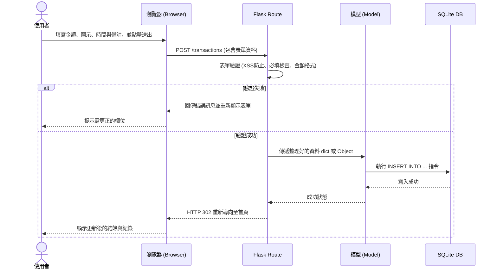

# 流程圖文件 (FLOWCHART)

這份文件為「個人記帳簿」專案的流程圖設計，視覺化使用者的操作路徑與系統內部的資料流。

## 1. 使用者流程圖（User Flow）

此圖表展示了使用者進入本網站後，可能經歷的各種操作路徑：

```mermaid
flowchart LR
    A([使用者開啟網頁]) --> B[首頁 - 總覽與月結算]
    B --> C{選擇欲執行的操作}
    
    C -->|查看明細列表| D[明細列表頁面]
    C -->|點擊新增收支| E[填寫新增收支表單]
    
    D --> F{針對單筆收支紀錄}
    F -->|點擊編輯| G[填寫編輯收支表單]
    F -->|點擊刪除| H[確認刪除]
    
    E --> I[儲存資料]
    G --> I
    H --> I
    
    I --> J[重新導向 (Redirect)]
    J --> B
```

## 2. 系統序列圖（Sequence Diagram）

以下描述「使用者點擊新增並送出表單」到「資料存入資料庫」的完整流程：



## 3. 功能清單與路由對照表

根據 PRD 與上述流程，我們將功能對應到常見的 HTTP 方法及 URL 端點 (Endpoints)：

| 功能名稱 | 功能說明 | HTTP 方法 | 預計路徑 (URL) | 結果行為 / 回應 |
| :--- | :--- | :--- | :--- | :--- |
| **首頁總覽** | 顯示當月總收入/支出、目前餘額，以及簡易圖表 | `GET` | `/` | 渲染 `index.html` 頁面 |
| **明細列表** | 條列顯示所有歷史收支紀錄，可進行篩選或分頁 | `GET` | `/transactions` | 渲染 `list.html` 頁面 |
| **新增頁面** | 渲染用於新增一筆收支的空白表單 | `GET` | `/transactions/new` | 顯示表單 |
| **新增收支** | 接收表單並將資料寫入資料庫 | `POST` | `/transactions` | 重新導向至 `/` 或 `/transactions` |
| **編輯頁面** | 載入特定 ID 的收支資料，供使用者編輯 | `GET` | `/transactions/<id>/edit` | 顯示載入原始資料的表單 |
| **更新收支** | 接收變更後的資料，更新指定 ID 的紀錄 | `POST` | `/transactions/<id>/update` | 重新導向至 `/` |
| **刪除收支** | 將指定 ID 的紀錄從資料庫中移除 | `POST` | `/transactions/<id>/delete` | 重新導向至 `/` |

> *註：考量到純前端 HTML Form 的限制，為確保不依賴外部框架的 AJAX 發送非同步請求，建立、更新、刪除的主要變更操作皆使用 `POST` 搭配獨立的後綴路徑 (如 `/update`, `/delete`) 來實作。*
